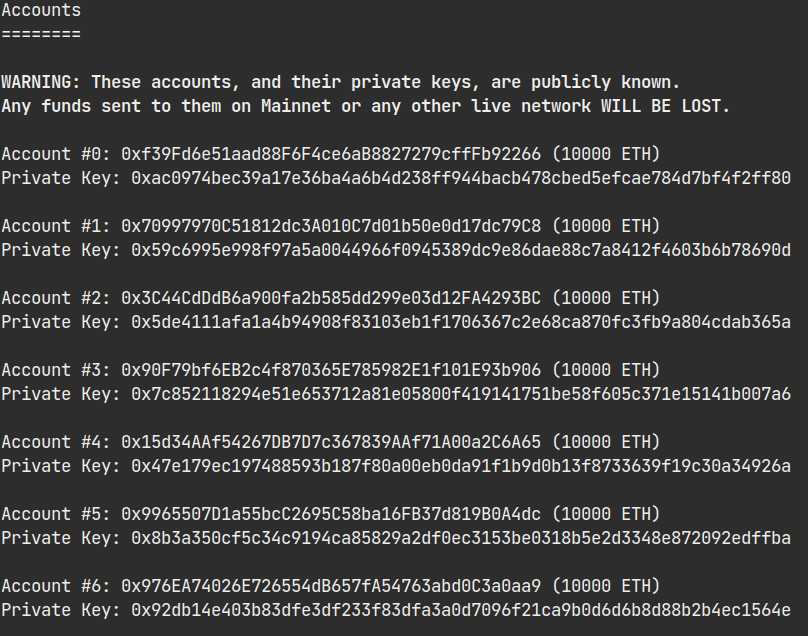
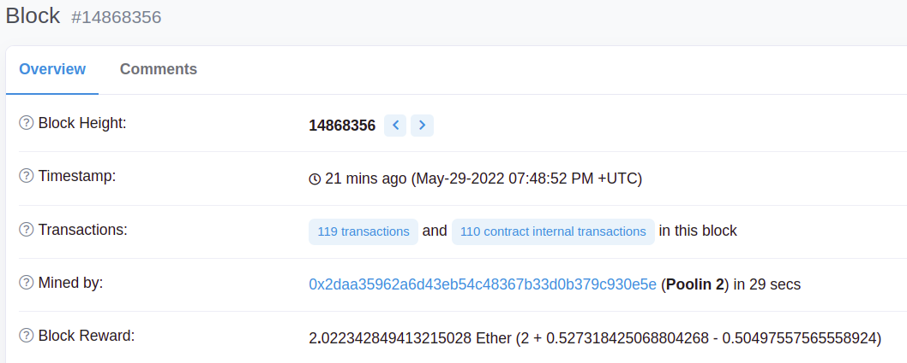

# How to Fork Ethereum Mainnet

Using the [available testnets](https://www.alchemy.com/overviews/what-are-testnets) to deploy your smart contracts is a great way to test them in a low cost and low risk environment. These testnets act and perform similarly to the Mainnet but they do not share the same transactions and data.

For certain projects, you may need to interact with previously deployed contracts, past transactions, and other historical data on the Mainnet. Forking Mainnet allows you to work with the most recent state of the Mainnet in order to test your projects on a local blockchain. Let’s see why and how we can do this:&#x20;

## Why Fork Mainnet?&#x20;

### Interact with previously deployed contracts&#x20;

Your smart contract may need to interact with existing smart contracts. Forking Mainnet allows you to work with deployed contracts to understand any risks and vulnerabilities before deploying to the Mainnet. It also allows your smart contract to use any data from the Mainnet that would be unavailable on a testnet. This could be critical to how your contract functions.&#x20;

### Impersonate Other Accounts&#x20;

Hardhat allows you to impersonate any Ethereum account on your local blockchain using the [`impersonateAccount` method.](https://hardhat.org/hardhat-network/reference#hardhat\_impersonateaccount)  This is useful if you would like to see the results when a certain account interacts with your smart contract. An example of this would be impersonating how a certain DAO member would interact with a deployed escrow smart contract as a seller.&#x20;

### Work with Complex Protocols&#x20;

Web3 Protocols continue to grow in reach and complexity. This growth requires that testing take place in an environment where any downstream effects of additions can be viewed. Forking mainnet allows you to see these changes and adapt to them before live deployment.&#x20;

## Required Tools

1. [A free Alchemy Account](https://alchemy.com/?a=1a16e957af)
2. [Hardhat](https://hardhat.org/)
3. Any Command Line Interface (CLI)&#x20;

## Setting up Alchemy&#x20;

In order to fork Mainnet, we will need to connect to the Ethereum network. The simplest way to do this is by creating [a free Alchemy account here](https://alchemy.com/?a=1a16e957af). An Alchemy account includes access to a full Ethereum archive node.

Full archive nodes are types of nodes that contain all the information about a blockchain from the genesis or original block. This is useful when forking Mainnet as you will be able to work with the historical data of the Ethereum blockchain that can be used in your local environment.

#### Creating an App and API Key

After creating your Alchemy account, you will need to create an app in the [Alchemy Dashboard](https://dashboard.alchemyapi.io) in order to generate an API key.

By navigating to the 'Apps' label in the navigation bar of the Alchemy Dashboard, you can create a new app by clicking on the 'Create App' button.


Since we will be forking Mainnet, make sure to use the following settings when creating your application:&#x20;

**Name**: Mainnet-Fork (or whatever you would like)&#x20;

**Description**: Description of what your app does so you can keep track&#x20;

**Chain**: Ethereum&#x20;

**Network**: Mainnet


Once the app has been successfully created, navigate to the 'View Key ' button in the App menu in order to see your API key for this app. These details will later be used to connect to Mainnet to complete the fork.


## Setting Up Hardhat&#x20;

Now that we have our [Alchemy account](https://alchemy.com/?a=1a16e957af) setup and an app created, you need to connect your configuration with Hardhat. Hardhat will allow you to fork Mainnet to a local blockchain so that we can test and deploy our smart contracts.&#x20;

#### Installing Hardhat&#x20;

Installing Hardhat can be done by using npm which is included when you [install Node.js](https://nodejs.org/en/). If you are unsure if you have installed Node.js, you can run the command `node -v` in your terminal. This will return the version number of Node.js you have installed. For example:  v18.2.0

Let's start by creating a new directory for this project by running the following commands in the terminal:

```
mkdir mainnet_fork

cd mainnet_fork 
```

After creating the directory for our project, we can install Hardhat using npm in the terminal:

```
npm install --save-dev hardhat 
```


## Connecting Alchemy with Hardhat&#x20;

Now that we have successfully installed Hardhat, let’s connect it with our Alchemy API credentials we created earlier to perform the fork of Ethereum.

The simplest way to do this is by running the following command in the terminal:

```
npx hardhat node --fork https://eth-mainnet.alchemyapi.io/v2/<YOUR API KEY>
```

This command will execute the Hardhat package and create a fork of Mainnet. You will now be asked by Hardhat to give details on setting up your project:


You can use the following Hardhat project settings:&#x20;

**What do you want to do?** Create a basic sample project&#x20;

**Hardhat project root:** Directory of your project&#x20;

**Do you want to add a .gitignore?**: y&#x20;

**Help us improve Hardhat with anonymous crash reports & basic usage data:** Optional **Do you want to install this sample project's dependencies with npm (hardhat @nomiclabs/hardhat-waffle ethereum-waffle chai @nomiclabs/hardhat-ethers ethers)? (Y/n)**: y (Best Practice to make sure correct versions are installed)

You have now created a fork of the latest Mainnet block as well as 20 Test Wallet addresses that can be used for development and testing on this local blockchain.



To confirm that we have forked the latest block from Mainnet, you can send the following curl request into the terminal:

```
curl --location --request POST 'localhost:8545/' \ 
--header 'Content-Type: application/json' \ 
--data-raw '{ 
	"jsonrpc":"2.0", 
	"method":"eth_blockNumber", 
	"params":[], 
	"id":83 
	}'

```

You should then receive a response like the one below but your `result` will be different:

```
{"jsonrpc":"2.0","id":83,"result":"0xe2df84"}
```

The `result` value is the hexadecimal number of the latest Mainnet block. By using a [Hex convertor](https://www.rapidtables.com/convert/number/hex-to-decimal.html), you take the block number and reference it with Etherscan to validate that the timestamp is recent.



## Wrapping Up&#x20;

Now you have a blockchain that runs a forked version of Mainnet locally! We can use this network to deploy and test our smart contracts without the costs of a live Mainnet deployment. This is a great way to understand how your contract or dApp will work on Mainnet by using the historical data and the test wallets available to you through Hardhat.

If you are looking for inspiration on what projects to build, join our free [Road to Web3 course](https://docs.alchemy.com/alchemy/road-to-web3/welcome-to-the-road-to-web3) where you will learn Web3 by completing weekly projects and learning challenges!
